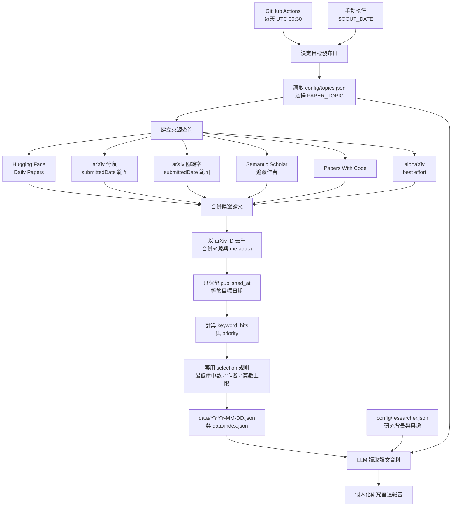

# 📰 Daily Paper Scout

[](https://github.com/voidful/paper-daily/actions/workflows/daily-crawl.yml)

GitHub Actions 每日自動從多個來源抓取論文，去重合併後，只保存指定日期正式發布的論文為結構化 JSON。
作為論文資料庫供 LLM（Grok、Claude、GPT 等）讀取並產出個人化篩選報告。

> 🙏 **致謝**：感謝 [voidful](https://github.com/voidful) 建立本專案的原始版本，完成多來源論文聚合、去重、排序與 GitHub Actions 每日自動化的核心架構。現在的可配置主題與發布日期流程，都是建立在這個扎實基礎之上。

這個專案的定位是可重用的「每日研究雷達」，不限定語音或 AI。研究者不需要修改爬蟲程式，只要調整 [`config/topics.json`](config/topics.json) 的主題參數，以及 [`config/researcher.json`](config/researcher.json) 的個人研究背景。

---

## ✨ Features

- 🕐 **每日自動執行** — GitHub Actions 在 UTC+8 08:30 抓取前一個完整 UTC 發布日
- 📅 **依發布日收錄** — 不把滾動的「最新 N 篇」誤當成當日新論文
- 🔀 **多來源聚合** — HuggingFace / arXiv / Semantic Scholar / Papers With Code / alphaXiv
- 🧹 **智慧去重** — 以 arXiv ID 為主鍵，合併多來源 metadata
- 🧭 **可切換主題** — 用 `PAPER_TOPIC` 選擇 `audio_speech`、`general_ai` 或自訂 profile
- 🎛️ **研究者可配置** — 分類、關鍵字、作者、收錄門檻與篇數上限都由 JSON 控制
- 📊 **預排序優先級** — 基於關鍵字命中、多來源交叉、社群熱度、追蹤作者
- 🤖 **LLM-Ready** — JSON 可直接被 Grok Task / Claude / GPT 讀取篩選

---

## 📁 目錄結構

```
paper-daily/
├── .github/workflows/
│   └── daily-crawl.yml      ← GitHub Actions 定時排程
├── scripts/
│   └── crawl.py              ← 爬蟲主程式
├── config/
│   ├── topics.json           ← 分類、關鍵字、作者等主題設定
│   └── researcher.json       ← 個人背景、研究興趣與報告篇數
├── data/
│   ├── index.json             ← 所有日期的索引
│   ├── 2026-04-16.json        ← 當天所有論文（去重、預排序）
│   ├── 2026-04-15.json
│   └── ...
├── grok-task-prompt.md        ← Grok Task 用的 prompt 範本
├── .gitignore
└── README.md
```

## 🔄 運作原理

整個流程可以看成「先找候選，再確認發布日，最後交給 LLM 做研究判讀」：



### 用白話說

1. **觸發**：排程每天執行；沒有手動指定日期時，會抓前一個完整 UTC 日，避免漏掉當天稍晚發布的論文。
2. **決定範圍**：`PAPER_TOPIC` 選擇主題 profile；profile 決定 arXiv 分類、關鍵字、搜尋詞與追蹤作者。
3. **抓取候選**：不同來源各自回傳論文 metadata。來源抓到的是候選池，不代表每篇都會被保存。
4. **日期與去重**：以 `published_at` 過濾目標日期，再用 arXiv ID 合併同一篇在不同來源出現的資料。
5. **排序與選擇**：計算關鍵字命中與 priority，再套用 `selection` 的門檻和篇數上限。
6. **交給 LLM**：JSON 提供「今天有哪些論文」，`researcher.json` 提供「這位研究者關心什麼」，兩者合起來才會產生個人化報告。

> Mermaid 圖描述的是資料流程，不是每個來源都一定成功；例如 alphaXiv 失敗時，其他來源仍可完成當日資料。

---

## 📄 JSON 格式

### `data/index.json`

```json
{
  "latest": "2026-04-16",
  "entries": [
    {
      "date": "2026-04-16",
      "topic": "audio_speech",
      "file": "2026-04-16.json",
      "total_papers": 185,
      "keyword_matched": 32,
      "crawled_at": "2026-04-16T00:30:00Z"
    }
  ]
}
```

### `data/{YYYY-MM-DD}.json`

```json
{
  "date": "2026-04-16",
  "topic": "audio_speech",
  "crawled_at": "2026-04-16T00:30:00Z",
  "stats": {
    "sources": { "huggingface": 45, "arxiv_cs.CL": 80, "..." : "..." },
    "total_crawled": 350,
    "after_dedup": 280,
    "published_on_date": 24,
    "selected_papers": 18,
    "missing_published_at": 0,
    "keyword_matched": 12
  },
  "papers": [
    {
      "id": "2406.12345",
      "title": "Neural Audio Codec with Semantic Alignment",
      "authors": ["Alice", "Bob"],
      "abstract": "We propose a novel ...",
      "published_at": "2026-04-16T00:00:00Z",
      "updated_at": "2026-04-16T00:00:00Z",
      "sources": ["huggingface", "arxiv_cs.CL"],
      "url": "https://arxiv.org/abs/2406.12345",
      "keyword_hits": 5,
      "priority": 65.0,
      "upvotes": 12,
      "tracked_author": "Hung-yi Lee"
    }
  ]
}
```

---

## 🌐 資料來源

| Source | Method | Rate Limit | Notes |
|--------|--------|------------|-------|
| HuggingFace Daily Papers | REST API | None | 社群投票數 (`upvotes`) |
| arXiv categories | Atom API | 3s interval | 依主題分類與指定發布日查詢，單分類最多 200 篇 |
| arXiv keyword search | Atom API | 3s interval | 依 profile 搜尋詞與指定發布日查詢，單詞最多 100 篇 |
| Semantic Scholar | Graph API v1 | 1s interval | 追蹤特定作者的最新論文 |
| Papers With Code | REST API v1 | None | 最新 50 篇 |
| alphaXiv trending | Web scraping | Best effort | 熱門論文排名 |

### 預設 `audio_speech` 追蹤研究者

| Researcher | Semantic Scholar ID |
|------------|---------------------|
| Geoffrey E. Hinton | `1695689` |
| Yoshua Bengio | `1751762` |
| Demis Hassabis | `48987704` |
| Ashish Vaswani | `40348417` |
| Noam Shazeer | `1846258` |
| Niki Parmar | `3877127` |
| Jakob Uszkoreit | `39328010` |
| Llion Jones | `145024664` |
| Aidan N. Gomez | `19177000` |
| Lukasz Kaiser | `40527594` |
| I. Polosukhin | `3443442` |

> Fei-Fei Li 會在 Semantic Scholar API 的同名作者確認完成後加入，避免誤追蹤錯誤 profile。

---

## 🔑 關鍵字系統

爬蟲會計算每篇論文的 `keyword_hits`，匹配的關鍵字涵蓋：

- **Audio/Speech**: audio codec, neural codec, TTS, ASR, voice cloning, HuBERT, wav2vec ...
- **Methods**: continual fine-tuning, inference-time scaling, early exit, DPO ...
- **Models**: LoRA, PEFT, multimodal, large language model, Qwen2-Audio ...

完整列表見 [`config/topics.json`](config/topics.json) 中對應 profile 的 `keywords`。

---

## 🤖 LLM 讀取方式

### 直接讀取 Raw URL

```
https://raw.githubusercontent.com/voidful/paper-daily/main/data/index.json
https://raw.githubusercontent.com/voidful/paper-daily/main/data/{YYYY-MM-DD}.json
```

### 搭配 Grok Task

參考 [`grok-task-prompt.md`](grok-task-prompt.md) 的 prompt 範本，設定 Grok 每日自動讀取 JSON 並產出個人化論文報告。

### 搭配 Codex、Claude Code、OpenClaw、Hermes

可直接使用 [`skills/daily-paper-scout/SKILL.md`](skills/daily-paper-scout/SKILL.md)。這份 skill 會要求 Agent：

1. 先讀 `data/index.json` 找最新日期。
2. 再讀對應的 `data/{date}.json`、`config/researcher.json` 與 `config/topics.json`。
3. 驗證發布日期與統計數字後，依研究者設定分析論文。
4. 將 metadata、論文原文證據與 Agent 推論分開，避免把截斷摘要當成完整論文。

任何支援 HTTP 或 Markdown skill 的 Agent，都可以直接讀取 GitHub Raw URL；不需要先 clone repository。

### GitHub Raw 還是 GitHub Pages？

目前直接使用 GitHub Raw 已經足夠，而且更適合 Agent：

| 需求 | 建議 |
|------|------|
| Codex／Claude Code／OpenClaw／Hermes 讀 JSON | GitHub Raw，直接、穩定、無需額外前端 |
| 人類瀏覽每日論文 | GitHub Pages，再加一個簡單的 JSON viewer |
| 對外提供 API 或搜尋介面 | 之後再加 Pages／靜態前端，不改變 Raw JSON 作為 canonical source |

因此目前建議保留 GitHub Raw 作為唯一資料來源；GitHub Pages 是改善閱讀體驗的可選展示層，不是必要條件。

### 篩選建議

| 欄位 | 用途 |
|------|------|
| `keyword_hits ≥ 3` | 強候選，與研究方向高度相關 |
| `priority ≥ 50` | 綜合評分高（多來源 + 關鍵字 + 熱度） |
| `tracked_author` 不為空 | 追蹤研究者的新論文 |
| `sources` 長度 ≥ 2 | 多平台同時出現，值得注意 |

---

## 🚀 Setup

### 使用方式（推薦）

1. **Fork** 這個 repository
2. GitHub Actions 會自動啟用
3. 每天 **UTC 00:30**（台北時間 08:30）自動索引前一個完整 UTC 發布日
4. 資料會自動 commit 到 `data/` 資料夾

> **不需要任何 API key。** 所有資料來源都使用公開 API。

### 手動觸發

到 **Actions → Daily Paper Crawl → Run workflow**，可以指定發布日期與 topic；日期留空時使用前一個完整 UTC 日。

### 本地開發

```bash
# 執行爬蟲
python scripts/crawl.py

# 指定日期
SCOUT_DATE=2026-04-15 python scripts/crawl.py

# 切換成一般 AI 主題
PAPER_TOPIC=general_ai python scripts/crawl.py
```

### 自訂論文主題

新研究者通常只需要編輯兩個檔案：

1. [`config/topics.json`](config/topics.json)：決定抓什麼、留下什麼。
2. [`config/researcher.json`](config/researcher.json)：告訴 LLM 研究背景、興趣與目前問題。

在 `topics.json` 新增一個 profile，可使用下列參數：

| 參數 | 用途 | 範例 |
|------|------|------|
| `name` | 顯示名稱 | `Database Systems` |
| `description` | 主題說明 | `Distributed databases and query optimization` |
| `arxiv_categories` | 完整索引的 arXiv 分類 | `cs.DB`, `cs.DC` |
| `keywords` | 相關性與 priority 計分 | `query optimizer`, `vector database` |
| `keyword_searches` | 跨分類額外搜尋 | `learned query optimization` |
| `tracked_authors` | Semantic Scholar 作者名稱與 ID | 可留空 `{}` |
| `selection.min_keyword_hits` | 至少命中幾個關鍵字才保存；`0` 表示保存分類內全部論文 | `1` |
| `selection.include_tracked_authors` | 即使未命中關鍵字，仍保存追蹤作者論文 | `true` |
| `selection.max_papers` | 每日最多保存篇數；`0` 表示不限制 | `50` |

例如一位資料庫研究者可以新增：

```json
"database_systems": {
  "name": "Database Systems",
  "description": "Database engines, query optimization and data systems.",
  "arxiv_categories": ["cs.DB", "cs.DC"],
  "keywords": ["query optimization", "database system", "vector database", "transaction"],
  "keyword_searches": ["learned query optimizer", "LLM for databases"],
  "tracked_authors": {},
  "selection": {
    "min_keyword_hits": 1,
    "include_tracked_authors": true,
    "max_papers": 50
  }
}
```

之後以 `PAPER_TOPIC=profile名稱 python scripts/crawl.py` 執行；GitHub Actions 手動執行時也可以選擇 topic。

> arXiv 查詢會直接限定指定發布日期；其他來源仍可能讀取「最新一批」作為候選池，但輸出的 `papers` 一律只包含 `published_at` 等於指定日期的論文。週末或休刊日可能正常產生 0 篇。

---

## 📊 排序邏輯

每篇論文的 `priority` 分數計算方式：

| 因子 | 加分 |
|------|------|
| 每個關鍵字命中 | +10 |
| 每多出現一個來源 | +15 |
| HuggingFace upvotes（上限 50） | +0.5/vote |
| 追蹤研究者 | +20 |
| 引用數（上限 100） | +0.1/cite |
| alphaXiv 趨勢排名 | +max(0, 20-rank) |

---

## 📝 License

MIT
