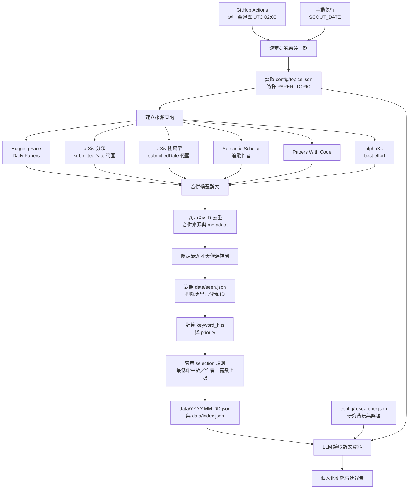

# 📰 Daily Paper Scout

[](https://github.com/tbdavid2019/paper-daily/actions/workflows/daily-crawl.yml)

GitHub Actions 於工作日自動從多個公開來源抓取論文，去重後將本專案第一次發現的相關論文保存為結構化 JSON。
作為論文資料庫供 LLM（Grok、Claude、GPT 等）讀取並產出個人化篩選報告。

> 🙏 **致謝**：感謝 [voidful](https://github.com/voidful) 建立本專案的原始版本，完成多來源論文聚合、去重、排序與 GitHub Actions 每日自動化的核心架構。現在的可配置主題與 first-seen 增量流程，都是建立在這個扎實基礎之上。

這個專案的定位是可重用的「每日研究雷達」，預設聚焦具身智能，也能透過設定改成其他研究方向。研究者不需要修改爬蟲程式，只要調整 [`config/topics.json`](config/topics.json) 的主題參數，以及 [`config/researcher.json`](config/researcher.json) 的個人研究背景。

---

## ✨ Features

- 🕐 **工作日自動執行** — GitHub Actions 於台灣時間週一至週五 10:00 執行
- 📅 **首次發現收錄** — 回看最近 4 天並用 `seen.json` 去重，接住週末延後公開的投稿
- 🔀 **多來源聚合** — HuggingFace / arXiv / Semantic Scholar / Papers With Code / alphaXiv
- 🧹 **智慧去重** — 以 arXiv ID 為主鍵，合併多來源 metadata
- 🧭 **可切換主題** — 預設 `embodied_ai`，亦可選擇 `general_ai` 或自訂 profile
- 🎛️ **研究者可配置** — 分類、關鍵字、作者、收錄門檻與篇數上限都由 JSON 控制
- 📊 **預排序優先級** — 基於關鍵字命中、多來源交叉、社群熱度、追蹤作者
- 🤖 **Agent-Ready** — 提供標準 JSON 與可安裝的 `SKILL.md`

---

## 📁 目錄結構

```
paper-daily/
├── .github/workflows/
│   └── daily-crawl.yml      ← GitHub Actions 定時排程
├── scripts/
│   └── crawl.py              ← 爬蟲主程式
├── config/
│   ├── topics.json           ← 分類、關鍵字、作者等主題設定
│   └── researcher.json       ← 個人背景、研究興趣與報告篇數
├── data/
│   ├── index.json             ← 每次研究雷達的索引
│   ├── seen.json              ← 各 topic 已發現的候選 ID
│   └── 2026-07-18.json        ← 該次首次發現的精選論文
├── .gitignore
└── README.md
```

## 🔄 運作原理

整個流程可以看成「回看候選視窗，找出第一次看到的論文，再交給 LLM 做研究判讀」：



### 用白話說

1. **觸發**：排程在台灣時間週一至週五 10:00 執行；週六、週日不執行。
2. **決定範圍**：`PAPER_TOPIC` 選擇主題 profile；profile 決定 arXiv 分類、關鍵字、搜尋詞、追蹤作者與各來源抓取上限。
3. **抓取候選**：不同來源各自回傳論文 metadata。來源抓到的是候選池，不代表每篇都會被保存。
4. **視窗與去重**：`published_at` 只用來限定回看視窗；是否收錄由 arXiv ID 在 `seen.json` 中的 `first_seen_on` 決定。
5. **排序與選擇**：計算關鍵字命中與 priority，再套用 `selection` 的門檻和篇數上限。所有候選 ID 都先記錄，不會因未進入前 30 篇而隔天重複出現。
6. **交給 LLM**：JSON 提供「本次雷達第一次發現什麼」，`researcher.json` 提供「這位研究者關心什麼」。

> Mermaid 圖描述的是資料流程，不是每個來源都一定成功；例如 alphaXiv 失敗時，其他來源仍可完成當日資料。

---

## 📄 JSON 格式

### `data/index.json`

```json
{
  "latest": "2026-07-18",
  "entries": [
    {
      "date": "2026-07-18",
      "topic": "embodied_ai",
      "file": "2026-07-18.json",
      "total_papers": 30,
      "keyword_matched": 91,
      "crawled_at": "2026-07-18T02:05:00Z"
    }
  ]
}
```

### `data/{YYYY-MM-DD}.json`

```json
{
  "date": "2026-07-18",
  "topic": "embodied_ai",
  "crawled_at": "2026-07-18T02:05:00Z",
  "stats": {
    "sources": { "huggingface": 100, "arxiv_cs.RO": 145, "..." : "..." },
    "total_crawled": 751,
    "after_dedup": 644,
    "window_start": "2026-07-14",
    "window_candidates": 590,
    "already_seen": 0,
    "new_candidates": 590,
    "selected_papers": 30,
    "missing_published_at": 0,
    "keyword_matched": 91
  },
  "papers": [
    {
      "id": "2607.15275",
      "title": "RoboTTT: Context Scaling for Robot Policies",
      "authors": ["Yunfan Jiang", "Yevgen Chebotar", "Ruijie Zheng"],
      "abstract": "We propose a novel ...",
      "published_at": "2026-07-16T00:00:00Z",
      "updated_at": "2026-07-16T00:00:00Z",
      "first_seen_at": "2026-07-18T02:05:00Z",
      "sources": ["huggingface", "arxiv_cs.RO", "arxiv_cs.AI", "arxiv_keyword"],
      "url": "https://arxiv.org/abs/2607.15275",
      "keyword_hits": 3,
      "priority": 75.0
    }
  ]
}
```

---

## 🌐 資料來源

| Source | Method | Rate Limit | Notes |
|--------|--------|------------|-------|
| HuggingFace Daily Papers | REST API | None | 社群投票數 (`upvotes`) |
| arXiv categories | Atom API | 3s interval | 依 `arxiv_categories` 動態查詢，數量由 `source_limits` 控制 |
| arXiv keyword search | Atom API | 3s interval | 依 `keyword_searches` 查詢，數量由 `source_limits` 控制 |
| Semantic Scholar | Graph API v1 | 可設定間隔 | 追蹤作者數、每人論文數與請求間隔皆由 `source_limits` 控制 |
| Papers With Code | REST API v1 | None | 最新 50 篇 |
| alphaXiv trending | Web scraping | Best effort | 熱門論文排名 |

### 預設不綁定研究者

`embodied_ai` 的 `tracked_authors` 預設為空，`semantic_scholar_max_authors` 設為 `0`，因此不會呼叫 Semantic Scholar 作者 API。這不會排除任何學者；所有人的論文仍可透過 arXiv 分類、關鍵字與其他來源進入候選池，避免研究雷達偏向少數知名實驗室。

若要建立人物追蹤型 profile，可自行加入 Semantic Scholar 作者 ID，再提高 `semantic_scholar_max_authors`。只有被指定的作者會獲得 `tracked_author` 標記與排序加分。

---

## 🔑 關鍵字系統

爬蟲會依目前 topic 計算每篇論文的 `keyword_hits`。預設 `embodied_ai` 主要涵蓋：

- **模型**：vision-language-action、robot foundation model、world model
- **任務**：dexterous/mobile manipulation、navigation、locomotion
- **感知**：3D、tactile、visuotactile、proprioception
- **學習方法**：imitation learning、diffusion policy、sim-to-real、robotics RL

完整列表見 [`config/topics.json`](config/topics.json) 中對應 profile 的 `keywords`。

---

## 🤖 Agent Skill 安裝與使用

Skill 檔案：[`skills/daily-paper-scout/SKILL.md`](skills/daily-paper-scout/SKILL.md)

資料入口：

```text
https://raw.githubusercontent.com/tbdavid2019/paper-daily/main/data/index.json
https://raw.githubusercontent.com/tbdavid2019/paper-daily/main/config/researcher.json
https://raw.githubusercontent.com/tbdavid2019/paper-daily/main/config/topics.json
```

### 已在 repository 內

把下面這段交給 Agent：

```text
先讀取 skills/daily-paper-scout/SKILL.md。
依照它的流程讀取 data/index.json，找到 latest 對應的 JSON，
再讀取 config/researcher.json 與 config/topics.json，產出研究報告。
```

### Codex 全域安裝

```bash
git clone https://github.com/tbdavid2019/paper-daily.git
mkdir -p "${CODEX_HOME:-$HOME/.codex}/skills"
cp -R paper-daily/skills/daily-paper-scout "${CODEX_HOME:-$HOME/.codex}/skills/"
```

重新啟動 Codex 後輸入：

```text
使用 daily-paper-scout skill，讀取最新研究雷達 JSON 並產生研究報告。
```

### Claude Code 專案安裝

在你的 Claude Code 專案根目錄執行：

```bash
mkdir -p .claude/skills
cp -R paper-daily/skills/daily-paper-scout .claude/skills/
```

重新啟動 Claude Code 後輸入：

```text
載入 daily-paper-scout，從 GitHub Raw 讀取最新 JSON，依 researcher.json 分析。
```

### OpenClaw、Hermes 或其他 Agent

這些工具若沒有固定的 skill 目錄，直接要求它讀取 Raw skill URL：

```text
https://raw.githubusercontent.com/tbdavid2019/paper-daily/main/skills/daily-paper-scout/SKILL.md
```

```text
請先讀取並遵守這個 skill：
https://raw.githubusercontent.com/tbdavid2019/paper-daily/main/skills/daily-paper-scout/SKILL.md
接著讀取同一 repository 的 data/index.json，找到 latest 對應的 JSON，
再依 config/researcher.json 分析並輸出報告。
```

Skill 載入後固定執行：

1. 先讀 `data/index.json` 找最新日期。
2. 再讀對應的 `data/{date}.json`、`config/researcher.json` 與 `config/topics.json`。
3. 驗證雷達日期、first-seen 統計與來源數字後，依研究者設定分析論文。
4. 將 metadata、論文原文證據與 Agent 推論分開，避免把截斷摘要當成完整論文。

除 Codex／Claude Code 的本地安裝外，其他 Agent 都可以直接讀 Raw URL，不需要 clone repository。

### 篩選建議

| 欄位 | 用途 |
|------|------|
| `keyword_hits ≥ 3` | 強候選，與研究方向高度相關 |
| `priority ≥ 50` | 綜合評分高（多來源 + 關鍵字 + 熱度） |
| `tracked_author` 不為空 | 追蹤研究者的新論文 |
| `sources` 長度 ≥ 2 | 多平台同時出現，值得注意 |

---

## 🚀 Setup

### 使用方式（推薦）

1. **Fork** 這個 repository
2. GitHub Actions 會自動啟用
3. 台灣時間週一至週五 **10:00**（UTC 02:00）自動建立當日首次發現清單
4. 資料會自動 commit 到 `data/` 資料夾

> **不需要任何 API key。** 所有資料來源都使用公開 API。

### 手動觸發

到 **Actions → Daily Paper Crawl → Run workflow**，可以指定雷達日期與 topic；日期留空時使用當前 UTC 日。

### 本地開發

```bash
# 執行爬蟲
python scripts/crawl.py

# 指定雷達日期（同日重跑可重現）
SCOUT_DATE=2026-04-15 python scripts/crawl.py

# 切換成一般 AI 主題
PAPER_TOPIC=general_ai python scripts/crawl.py

# 具身智能（目前預設）
PAPER_TOPIC=embodied_ai python scripts/crawl.py
```

### 自訂論文主題

新研究者通常只需要編輯兩個檔案：

1. [`config/topics.json`](config/topics.json)：決定抓什麼、留下什麼。
2. [`config/researcher.json`](config/researcher.json)：告訴 LLM 研究背景、興趣與目前問題。

`researcher.json` 的 `report` 只控制 LLM 報告，不影響爬蟲：

| 參數 | 用途 |
|------|------|
| `target_papers` | 報告最多推薦幾篇 |
| `must_read_threshold` | Must-Read 分數門檻 |
| `highly_relevant_threshold` | Highly Relevant 分數門檻 |
| `language` | `auto` 跟隨提問者語言；也可明確指定語言 |

在 `topics.json` 新增一個 profile，可使用下列參數：

| 參數 | 用途 | 範例 |
|------|------|------|
| `name` | 顯示名稱 | `Database Systems` |
| `description` | 主題說明 | `Distributed databases and query optimization` |
| `arxiv_categories` | 完整索引的 arXiv 分類 | `cs.DB`, `cs.DC` |
| `keywords` | 相關性與 priority 計分 | `query optimizer`, `vector database` |
| `keyword_searches` | 跨分類額外搜尋 | `learned query optimization` |
| `tracked_authors` | Semantic Scholar 作者名稱與 ID | 可留空 `{}` |
| `source_limits.lookback_days` | 向前回看幾天，用來接住延遲公開的投稿 | `4` |
| `source_limits.arxiv_category_max_results` | 每個 arXiv 分類最多讀取幾篇候選 | `250` |
| `source_limits.arxiv_keyword_max_results` | 每個 arXiv 搜尋詞最多讀取幾篇候選 | `100` |
| `source_limits.semantic_scholar_max_authors` | 每日最多查詢幾位作者；`0` 表示停用 | `4` |
| `source_limits.semantic_scholar_papers_per_author` | 每位作者最多讀取幾篇近期論文 | `5` |
| `source_limits.semantic_scholar_delay_seconds` | 作者 API 請求之間至少等待幾秒 | `3` |
| `selection.min_keyword_hits` | 至少命中幾個關鍵字才保存；`0` 表示保存分類內全部論文 | `1` |
| `selection.include_tracked_authors` | 即使未命中關鍵字，仍保存追蹤作者論文 | `true` |
| `selection.max_papers` | 每日最多保存篇數；`0` 表示不限制 | `50` |

例如一位資料庫研究者可以新增：

```json
"database_systems": {
  "name": "Database Systems",
  "description": "Database engines, query optimization and data systems.",
  "arxiv_categories": ["cs.DB", "cs.DC"],
  "keywords": ["query optimization", "database system", "vector database", "transaction"],
  "keyword_searches": ["learned query optimizer", "LLM for databases"],
  "tracked_authors": {},
  "source_limits": {
    "lookback_days": 4,
    "arxiv_category_max_results": 250,
    "arxiv_keyword_max_results": 100,
    "semantic_scholar_max_authors": 0,
    "semantic_scholar_papers_per_author": 5,
    "semantic_scholar_delay_seconds": 3
  },
  "selection": {
    "min_keyword_hits": 1,
    "include_tracked_authors": true,
    "max_papers": 30
  }
}
```

之後以 `PAPER_TOPIC=profile名稱 python scripts/crawl.py` 執行；GitHub Actions 手動執行時也可以選擇 topic。`arxiv_categories` 中的每個分類會產生一次 arXiv 查詢，`keyword_searches` 中的每個詞也會產生一次查詢；要降低流量時，優先減少這兩個陣列的項目數，而不只是降低回傳篇數。

> `published_at` 是上游的初次投稿／發布 metadata，不是本專案的收錄日。當日是否收錄以 `seen.json` 中的首次發現記錄為準。第一次執行是 bootstrap snapshot；後續執行才是穩定的增量雷達。

---

## 📊 排序邏輯

每篇論文的 `priority` 分數計算方式：

| 因子 | 加分 |
|------|------|
| 每個關鍵字命中 | +10 |
| 每多出現一個來源 | +15 |
| HuggingFace upvotes（上限 50） | +0.5/vote |
| 追蹤研究者 | +20 |
| 引用數（上限 100） | +0.1/cite |
| alphaXiv 趨勢排名 | +max(0, 20-rank) |

---

## 📝 License

本衍生版本采用 `AGPL-3.0-or-later`。原作者 voidful 的 MIT 授权声明保留于 [`LICENSE-MIT`](LICENSE-MIT)，详见 [`NOTICE`](NOTICE)。生成的论文 metadata 仍可能受上游资料来源条款约束。
